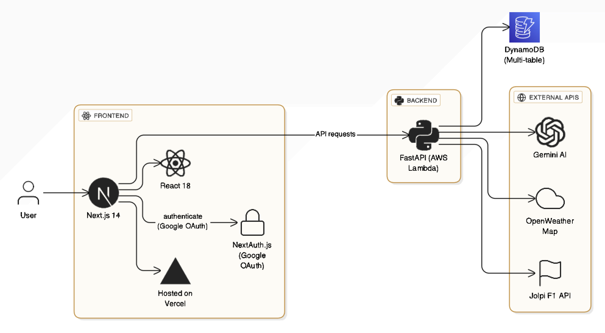

# F1 Race Strategy Simulator

A comprehensive Formula 1 race strategy simulator that helps you plan, simulate, and optimize race strategies with real data, weather conditions, AI recommendations, and advanced analytics.

**Live Demo:** [https://f1-race-sim.vercel.app](https://f1-race-sim.vercel.app)

---

## System Architecture (High Level Design)




## Features

### Core Functionality
- **Track Selection** - Choose from F1 circuits with real data
- **Strategy Builder** - Create and edit multiple race strategies
- **Race Simulation** - Run detailed simulations with realistic results
- **AI Recommendations** - Get strategy advice from Google Gemini AI
- **Weather Integration** - Real-time weather data simulation with OpenWeatherMap API
- **Strategy Comparison** - Compare up to 5 strategies side by side
- **Interactive Charts** - Visualize simulation results with ApexCharts and Recharts
- **Tire Strategy** - Multiple compounds (Soft, Medium, Hard, Intermediate, Wet) with degradation modeling
- **Pit Stop Optimization** - Strategic timing and tire changes
- **Driver Styles** - Aggressive, Balanced, and Conservative options with performance impacts
- **Performance Metrics** - Lap times, fuel consumption, position tracking, tire wear analysis

### User Management & Analytics
- **Google Authentication** - Secure sign-in with NextAuth.js
- **Usage Tracking** - Monitor daily usage across all features with rate limiting
- **Plan Management** - Free, Pro, and Business tier support
- **Waitlist System** - Join waitlist for premium plans
- **Admin Dashboard** - Comprehensive user and system analytics
- **PDF Reports** - Generate detailed simulation reports with charts and analysis
- **Results Sharing** - Share simulation results via native sharing or clipboard

### Advanced Features
- **Real-time Weather** - Track conditions and grip levels with live API integration
- **Risk Analysis** - Comprehensive strategy risk assessment and optimization suggestions
- **Multi-car Simulation** - Advanced race scenarios with multiple competitors
- **Weather Forecasting** - Lap-by-lap weather predictions and impact analysis
- **Strategy Analytics** - Deep insights into strategy performance and recommendations

---

## Getting Started

### Quick Start

1. **Clone and Install**
```bash
git clone https://github.com/kirandevihosur74/F1RaceSim.git
cd F1RaceSim
npm install
```

2. **Backend Setup**
```bash
cd backend
python -m venv venv311
source venv311/bin/activate  # Windows: venv311\Scripts\activate
pip install -r requirements.txt
```

3. **Environment Configuration**
```bash
cp env.example .env.local
```

4. **Google OAuth Setup**
- Create Google OAuth credentials in [Google Cloud Console](https://console.cloud.google.com/)
- Add authorized redirect URIs:
  - `http://localhost:3000/api/auth/callback/google` (development)
  - `https://yourdomain.com/api/auth/callback/google` (production)

5. **Start Development Servers**
```bash
# Terminal 1: Frontend
npm run dev

# Terminal 2: Backend
cd backend
python main.py
```

Visit `http://localhost:3000` to see the application.

### How to Use

1. **Sign In** - Use Google authentication to access all features
2. **Choose a Track** - Pick from available F1 circuits
3. **Build Your Strategy** - Set pit stop laps, tire compounds, and driving style
4. **Save & Run** - Save your strategy and run the simulation
5. **View Results** - Simulation results appear in a popup window with interactive charts
6. **Download Reports** - Export detailed simulation results as PDF reports
7. **Get AI Tips** - Receive strategy recommendations from AI
8. **Compare Results** - Test multiple strategies side by side


---

## Plan Features & Limits

### Free Plan
- Basic Race Strategy Creation
- 1 Simulation per Day
- Strategy Comparison
- Weather Data
- Track Selection
- 1 AI Recommendation

### Pro Plan (Waitlist)
- Basic Race Strategy Creation
- Strategy Comparison
- Weather Data
- Track Selection
- Advanced Analytics
- Unlimited Simulations
- Unlimited AI Recommendations

### Business Plan (Waitlist)
- Basic Race Strategy Creation
- Strategy Comparison
- Weather Data
- Track Selection
- Advanced Analytics
- Unlimited Simulations
- Unlimited AI Recommendations

---

## Tech Stack Used

### Frontend Stack
- **React 18** + **TypeScript** - Modern component architecture
- **Next.js 14** - Full-stack React framework with API routes
- **Tailwind CSS** - Utility-first styling with dark mode support
- **Zustand** - Lightweight state management
- **FontAwesome** - Professional icon library (used throughout UI)
- **ApexCharts** + **Recharts** - Interactive data visualization
- **NextAuth.js** - Secure authentication with Google OAuth
- **Lucide React** - Additional icon components

### Backend & Infrastructure
- **FastAPI** - High-performance Python API for race simulation
- **AWS DynamoDB** - NoSQL database for user data and usage tracking
- **AWS Lambda** - Serverless function deployment
- **Google Gemini AI** - Advanced strategy recommendations
- **OpenWeatherMap API** - Real-time weather data integration
- **Jolpi API** - F1 circuit and race data with fallback to local data
- **PDF Generation** - Client-side PDF report generation with charts

---

## Deployment

### Frontend (Vercel)
```bash
npm run build
vercel --prod
```

### Backend (AWS Lambda)
```bash
cd backend
sam build
sam deploy --guided
```

### Environment Variables
Configure these in your deployment platform:
- `NEXTAUTH_SECRET` - Secure random string
- `NEXTAUTH_URL` - Your production domain
- `GOOGLE_CLIENT_ID` - Google OAuth client ID
- `GOOGLE_CLIENT_SECRET` - Google OAuth client secret
- `AWS_ACCESS_KEY_ID` - AWS credentials
- `AWS_SECRET_ACCESS_KEY` - AWS credentials
- `METADATA_TABLE` - DynamoDB table name

---

## Testing

### Frontend Tests
```bash
# Run all tests
npm test

# Watch mode
npm run test:watch

# Coverage report
npm run test:coverage

# E2E tests
npm run test:e2e
```

### Backend Tests
```bash
cd backend
python -m pytest
```

---

## Contributing

1. Fork the repository
2. Create a feature branch (`git checkout -b feature/amazing-feature`)
3. Commit your changes (`git commit -m 'Add amazing feature'`)
4. Push to the branch (`git push origin feature/amazing-feature`)
5. Open a Pull Request

---

## Support

- **Issues**: [GitHub Issues](https://github.com/kirandevihosur74/F1RaceSim/issues)
- **Email**: kirandevihosur74@gmail.com

## If you like my work, follow me on [X (Twitter)](https://x.com/kiran_devihosur)

---
